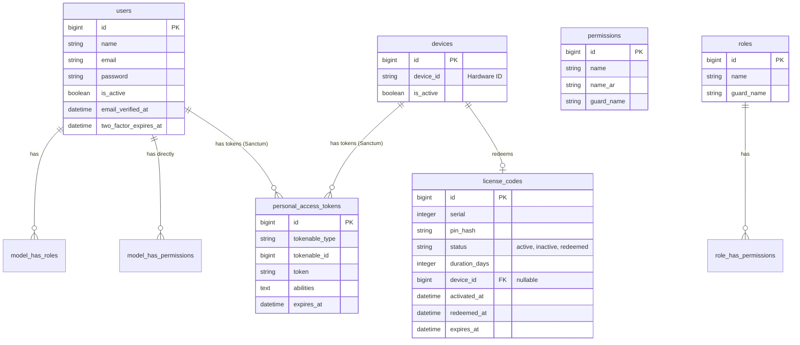

# CodeVault

A comprehensive digital solution for generating, distributing, and managing software license codes bound to hardware identifiers, ensuring secure, single-device software licensing.

## 🚀 Key Features

### 🔐 License & Hardware Management

- **Hardware-Locking:** Redeem license codes that permanently bind to a specific device's hardware ID.
- **Token Issue & Revocation:** Secure API communication via Sanctum tokens tied directly to devices, with an admin toggle to revoke access.
- **License Expiration & Renewal:** Tracks license duration, automated expiration calculation upon activation, and renewal capabilities.

### ⚙️ Admin Dashboard

- **Batch Operations:** Generate large batches of random license codes with specific durations.
- **Range Control:** Quickly activate or delete a range of sequentially issued serial numbers.
- **Real-Time Export:** Instantly export unused or generated codes to Excel spreadsheets for distribution.
- **Device Management:** Oversee activated devices and revoke tokens instantly.

### 🛡️ Authentication & Authorization

- **Role-Based Access Control (RBAC):** Granular permission management via Spatie permissions for roles (Super Admin, Supervisor, Client).
- **Two-Factor Authentication (2FA):** Secure mail-based OTP for administrative user logins.
- **Brute-Force Protection:** Rate-limiting applied to crucial endpoints (login, redemption) to prevent attacks.

## 🗄️ Database Schema

Here is an Entity Relationship Diagram representing the core CodeVault structure:



## 🛠️ Tech Stack

### Backend

- **Framework:** [Laravel 12.x](https://laravel.com)
- **Features:** Sanctum API Authentication, Spatie Permission (RBAC), Maatwebsite Excel Exports.

### Frontend

- **Framework:** [Vue 3](https://vuejs.org/)
- **UI & Styling:** PrimeVue 4, Tailwind CSS v4
- **State Management:** Pinia
- **Build Tool:** Vite

## 📦 Getting Started

### Quick Setup

```bash
# Backend Setup
composer install
cp .env.example .env
php artisan key:generate
php artisan migrate --seed
php artisan serve

# Frontend Setup
cd frontend
npm install
npm run dev
```


